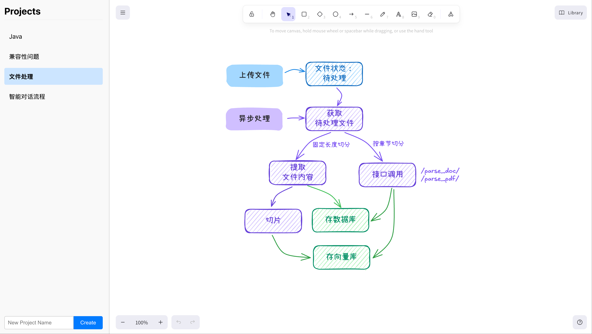

# Venus - Drawing Project Manager

A web application for managing Excalidraw drawing projects, now powered by Rust and Axum!



## Tech Stack

### Backend (New - Rust)
- **Axum** - Modern async web framework
- **SQLite** - Database for project storage
- **SQLx** - Async SQL toolkit
- **JWT** - Authentication
- **Tokio** - Async runtime

### Frontend
- **Vue.js 3** - UI framework
- **Excalidraw** - Drawing canvas
- **Vite** - Build tool

## Features

- Create and manage drawing projects
- JWT authentication
- Project storage in SQLite database
- Static file serving for frontend
- CORS support
- Embedded frontend assets

## Quick Start

### Prerequisites
- Rust (latest stable)
- Node.js 16+
- npm

### Development Setup

1. **Clone the repository**
   ```bash
   git clone <repository-url>
   cd venus
   ```

2. **Frontend development** (optional, for frontend changes)
   ```bash
   cd frontend
   npm install
   npm run dev  # For development server
   npm run build  # To build for production
   ```

3. **Backend development**
   ```bash
   cd ..
   cargo run
   ```

### API Endpoints

- `GET /api/projects` - List projects
- `POST /api/projects` - Create project
- `GET /api/projects/:id` - Get project
- `PUT /api/projects/:id` - Update project
- `DELETE /api/projects/:id` - Delete project

### Authentication

- **Development**: Automatic authentication for localhost
- **Production**: JWT-based authentication with configurable auth URL

## Migration from Go

The application has been rewritten from Go (Gin) to Rust (Axum) with the following improvements:

- **Performance**: Rust's memory safety and zero-cost abstractions
- **Type Safety**: Compile-time guarantees
- **Async/Await**: Built on Tokio for excellent concurrency
- **Modern Architecture**: Clean separation of concerns
- **SQLite Integration**: Robust database operations with SQLx
- **Error Handling**: Comprehensive error handling with proper HTTP status codes

## Project Structure

```
venus/
├── src/
│   ├── main.rs          # Application entry point
│   ├── config.rs        # Configuration management
│   ├── database.rs      # Database connection and migrations
│   ├── auth.rs          # Authentication logic
│   ├── handlers.rs      # HTTP request handlers
│   └── models.rs        # Data models
├── migrations/          # Database migrations
├── frontend/            # Vue.js frontend
└── Cargo.toml          # Rust dependencies
```

## Development

### Adding New Features

1. Add database migrations in `migrations/`
2. Update models in `src/models.rs`
3. Add handlers in `src/handlers.rs`
4. Register routes in `src/main.rs`

### Testing

```bash
# Check code
cargo check

# Format code
cargo fmt

# Lint code
cargo clippy
```

## License

MIT License
